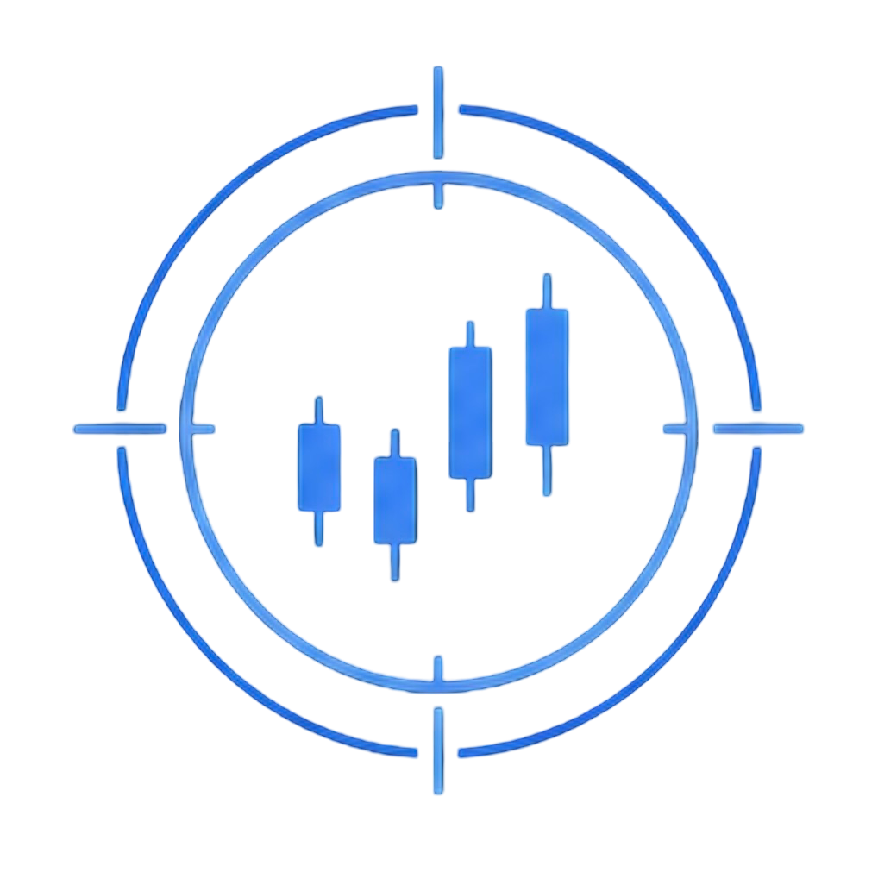

<p align="center">
  
</p>

<h1 align="center">Trade-Ops</h1>

<p align="center">
  <em>TradingView is the cockpit. Trade-Ops is everything behind it.</em>
</p>

<p align="center">
  
  
  
  
</p>

<p align="center">
  <a href="#overview">Overview</a> &middot;
  <a href="#why-trade-ops">Why Trade-Ops</a> &middot;
  <a href="#architecture">Architecture</a> &middot;
  <a href="#data-stack">Data Stack</a> &middot;
  <a href="#quick-start">Quick Start</a> &middot;
  <a href="#cli-reference">CLI Reference</a> &middot;
  <a href="#journal">Journal</a> &middot;
  <a href="#knowledge-base">Knowledge Base</a> &middot;
  <a href="#principles">Principles</a>
</p>

## Overview

Trade-Ops is a retail trading operating system. TradingView is the primary charting surface. Alpaca is the primary execution surface. Trade-Ops is everything behind both — the data layer, the memory layer, the risk framework, and the structured research workflow that connects raw market data to a decision.

It does not replace TradingView or Alpaca. It extends them with durable memory, structured workflows, and a data adapter layer that an AI agent can actually use.

> **This is not an auto-trader.** Trade-Ops is a discipline layer — it helps you think more clearly, track honestly, and review systematically. The AI never places a live order. You always have the final call.

---

## Why Trade-Ops

Most traders manage risk in their head and journal in a spreadsheet. Chat threads evaporate. Market reads accumulate nowhere useful. Research is not reproducible. Mistakes repeat.

**Trade-Ops solves this by:**

- Maintaining a persistent, structured knowledge base the agent compiles from raw journal records and adapter snapshots
- Normalizing data from 25+ sources into a consistent shape for agent analysis
- Enforcing a thesis-first, risk-box-required trade workflow with JSON + Markdown records
- Separating the signal research pipeline from the execution decision — candidates are not trades
- Keeping state in flat files so nothing critical lives only in a chat thread

---

## Architecture

Trade-Ops operates in two stages:

**Stage 1 — Research**: Multi-source data adapters feed raw market context. Chart state normalization converts candle data into indicators, distances, returns, and volatility flags. The signal engine produces ranked candidates with evidence and counter-evidence. Forecasting models (Chronos, TimesFM, Kronos) add probabilistic price distribution context.

**Stage 2 — Knowledge**: Every trade review updates the wiki — symbol memory, setup stats, edge notes, recurring mistakes. The agent maintains this layer; you never edit it manually. The journal is the immutable event record. The wiki is the synthesized understanding built from it.

### Repo Layout

```
trade-ops/
├── adapters/            # Source adapters by provider
├── config/              # Risk rules and taxonomy
├── docs/                # Architecture and supporting docs
├── journal/
│   ├── schema/          # Canonical trade schemas
│   ├── templates/       # Blank trade templates
│   ├── examples/        # Sample trades
│   ├── open/            # Local: active personal trades
│   └── closed/          # Local: completed personal trades
├── signals/
│   ├── schema/          # Observation, signal, score, candidate schemas
│   ├── examples/        # Scrubbed signal candidate examples
│   └── candidates/      # Local: generated candidate records
├── research/
│   ├── schema/          # Memo and skeptic review schemas
│   ├── examples/        # Scrubbed memo examples
│   └── memos/           # Local: generated research packets
├── reports/             # Local: generated boards, reviews, attribution
├── tools/               # CLI entry points (npm run *)
├── watchlists/          # Universe definitions and scan inputs
├── wiki/
│   ├── examples/        # Scrubbed example memory files
│   └── market/          # README tracked; context files local
└── tmp/                 # Local: scratch files and experiments
```

**Shareable project assets** live in Git. **Local working state** lives on your machine. If a file is reusable as an example, interface, template, or adapter — it belongs in Git. If it reflects your current account state, active research, or personal trading history — it stays local.

---

## Data Stack

| Adapter | Source | What It Provides |
|---|---|---|
| **Alpaca** | alpaca.markets | Paper positions, orders, fills, equity and crypto candles |
| **Yahoo Finance** | Yahoo | Live quotes, bars, multi-asset |
| **Massive** | massive.com / Polygon | Stocks, fundamentals, options, futures, Fed series, news, short data |
| **FRED** | stlouisfed.org | Macro snapshot — yields, CPI, VIX, Fed Funds |
| **FMP** | financialmodelingprep.com | Analyst consensus, price targets, earnings calendar |
| **SEC EDGAR** | sec.gov | Filings, ownership, insider activity |
| **CFTC** | publicreporting.cftc.gov | Commitments of Traders positioning |
| **Binance Futures** | binance.com | Funding, open interest, long/short ratio, taker flow |
| **Hyperliquid** | hyperliquid.xyz | Perp mark price, funding, open interest, 24h volume |
| **Deribit** | deribit.com | BTC/ETH options/futures books, IV, open interest |
| **Coinbase** | coinbase.com | Spot products, order books, candles |
| **Kraken** | kraken.com | Spot ticker, order books, OHLC |
| **CoinGecko** | coingecko.com | Aggregated prices, global market, trending, BTC treasury |
| **GeckoTerminal** | geckoterminal.com | On-chain pools, DEX OHLCV, Solana trending |
| **DexScreener** | dexscreener.com | Cross-chain pair search, liquidity, boosted tokens |
| **DeFiLlama** | defillama.com | Chain/protocol TVL, stablecoin supply, DEX volume, fees, yields |
| **RugCheck** | rugcheck.xyz | Solana token risk — authority checks, LP locks, holder concentration |
| **Kalshi** | kalshi.com | Prediction market discovery, orderbooks, trades, events |
| **Polymarket** | polymarket.com | Prediction market flow, CLOB books, wallet activity |
| **EIA** | eia.gov | WTI/Brent, crude inventories, nat gas storage, US production |
| **FRED** | stlouisfed.org | Macro — yields, CPI, VIX, Fed Funds |
| **BLS** | bls.gov | Labor, CPI, payroll, wages time series |
| **Treasury FiscalData** | fiscaldata.treasury.gov | Debt, Treasury statement, securities issuance |
| **FINRA** | finra.org | Daily short sale volume — short pressure and exhaustion signals |
| **Finnhub** | finnhub.io | Equity quotes, insider/congressional trading, earnings, news sentiment |
| **SecuritiesDB** | securitiesdb.com | Form 4 insider transactions, 13F institutional flow |
| **GDELT** | gdeltproject.org | Global geopolitical news search, coverage volume, tone timelines |
| **AlphaVantage** | alphavantage.co | News sentiment, market movers, earnings calendar, commodities |
| **BEA** | bea.gov | GDP and components, PCE, government spending, regional data |
| **Etherscan** | etherscan.io | Ethereum on-chain — whale tracking, exchange flows, gas, token transfers |
| **Fear & Greed** | alternative.me | Crypto sentiment index (0–100) |
| **AgentMail** | agentmail.to | Email delivery for generated market reads and research memos |
| **TradingView** | TradingView desktop | Chart state, indicators, paper positions |

Most sources have a free or public tier that works without an API key. See `.env.example` for the full key list.

---

## Quick Start

```bash
# 1. Clone
git clone https://github.com/brs999/trade-ops.git
cd trade-ops

# 2. Install Node dependencies
npm install

# 3. Add API keys
cp .env.example .env
# Edit .env: ALPACA_API_KEY, ALPACA_API_SECRET, FRED_API_KEY, FMP_API_KEY, etc.

# 4. Test the stack — these work without any API key
npm run fng       -- current
npm run yahoo     -- quote AAPL
npm run coingecko -- snapshot
npm run gecko     -- solana

# 5. Open with your AI agent
# AGENTS.md and CLAUDE.md are the context layer for Codex and Claude Code
```

### Optional: Local Forecasting Models

If you want to run Amazon Chronos, TimesFM, or NeoQuasar Kronos locally with Apple Silicon acceleration:

- Python 3.11 and `uv` are required
- Apple Silicon Mac with PyTorch `mps` support recommended

```bash
npm run chronos  -- setup && npm run chronos  -- forecast BTC-USD --range 5d --interval 1h --prediction-length 12
npm run timesfm  -- setup && npm run timesfm  -- forecast BTC-USD --range 5d --interval 1h --prediction-length 12
npm run kronos   -- setup && npm run kronos   -- forecast BTC-USD --range 5d --interval 1h
```

If you do not care about local forecasting, skip Python entirely.

---

## CLI Reference

```bash
# Positions and account
npm run alpaca -- positions
npm run alpaca -- orders --status open
npm run alpaca -- account
npm run alpaca -- bars GEV --timeframe 1Day --limit 260

# Chart state
npm run chart-state -- --input candles.json --symbol GEV --timeframe 1Day
node tools/alpaca.mjs bars GEV | npm run chart-state -- --symbol GEV --timeframe 1Day

# Market data
npm run yahoo       -- quote AAPL
npm run fred        -- macro
npm run fmp         -- summary AAPL
npm run fmp         -- earnings --from 2026-04-01 --to 2026-04-30
npm run sec         -- filings AAPL
npm run cftc        -- snapshot gold crude spx ndx eurusd bitcoin
npm run eia         -- snapshot
npm run finra       -- multi AAPL,MSFT,TSLA
npm run finnhub     -- snapshot PLTR
npm run securitiesdb -- snapshot PLTR
npm run gdelt       -- snapshot "tariff" --timespan 7d
npm run alphavantage -- gainers-losers
npm run bea         -- snapshot

# Crypto
npm run coingecko       -- snapshot
npm run coingecko       -- sovereign-btc
npm run gecko           -- solana
npm run gecko           -- trending-network solana 1h
npm run binance-futures -- snapshot BTCUSDT,ETHUSDT,SOLUSDT
npm run hyperliquid     -- snapshot BTC,ETH,SOL
npm run deribit         -- options-snapshot BTC,ETH
npm run dex             -- search "ETH/USDC" 10
npm run defillama       -- snapshot --limit 10
npm run fng             -- current
npm run etherscan       -- gas

# Prediction markets
npm run kalshi      -- scan
npm run kalshi      -- market --ticker <marketTicker>
npm run polymarket  -- scan --limit 100
npm run polymarket  -- btc-consensus-study --market-limit 50

# Equities — Massive
npm run massive -- snapshot AAPL
npm run massive -- options-chain AAPL
npm run massive -- options-unusual AAPL --min-volume 100
npm run massive -- futures-front ES
npm run massive -- short-volume NVDA --from 2026-06-01

# Delivery
npm run agentmail -- send --input reports/daily-board/2026-06-06.md --subject "Trade Ops Morning Read"
```

---

## Journal

Every trade is stored as a paired JSON + Markdown record.

```
journal/
├── open/            # Active positions
├── closed/          # Completed trades
├── schema/          # Trade schema + asset-class extensions
├── templates/       # Blank trade templates
└── examples/        # Sample entries
```

Every trade must define a symbol, side, setup type, entry, stop, target, reward/risk ratio, thesis, and invalidation condition. Outcome, mistakes, and lessons are added on close.

**Trade lifecycle:**

```
idea → watchlist → planned → ready → ordered → open → closed → reviewed
```

| Path | Git Behavior |
|---|---|
| `journal/schema/`, `journal/templates/`, `journal/examples/` | tracked |
| `journal/open/`, `journal/closed/` | local |

---

## Knowledge Base

The wiki is an LLM-maintained knowledge base compiled from raw journal records and adapter snapshots. The agent writes and updates it as trades are reviewed. You never edit it manually.

| Layer | What it is | Who writes it |
|---|---|---|
| `journal/` | What happened — immutable trade records | You (via agent) |
| `wiki/` | What you know — synthesized understanding | Agent only |

The journal answers *"what happened?"* The wiki answers *"what do I know?"*

| Path | Git Behavior |
|---|---|
| `wiki/README.md`, `wiki/examples/`, `wiki/market/README.md` | tracked |
| `wiki/symbols/`, `wiki/setups/`, `wiki/edges.md`, `wiki/mistakes.md`, `wiki/market/context.md` | local |

---

## Principles

- Paper before live — no live order without explicit confirmation
- Every trade needs a thesis, risk box, and review trail before opening
- Stop is the plan stop — do not widen after entry
- File-based storage is the canonical source of truth in V1
- The AI evaluates and enriches — you decide and execute
- A `no trade` conclusion should be a research conclusion, not the output of a scanner

---

## License

MIT

## Disclaimer

Trade-Ops is research and workflow software, not financial advice. Trading and investing involve substantial risk, including loss of capital. Always do your own research, validate data independently, and use paper trading before risking real money. You are responsible for your own decisions, orders, and risk management.
